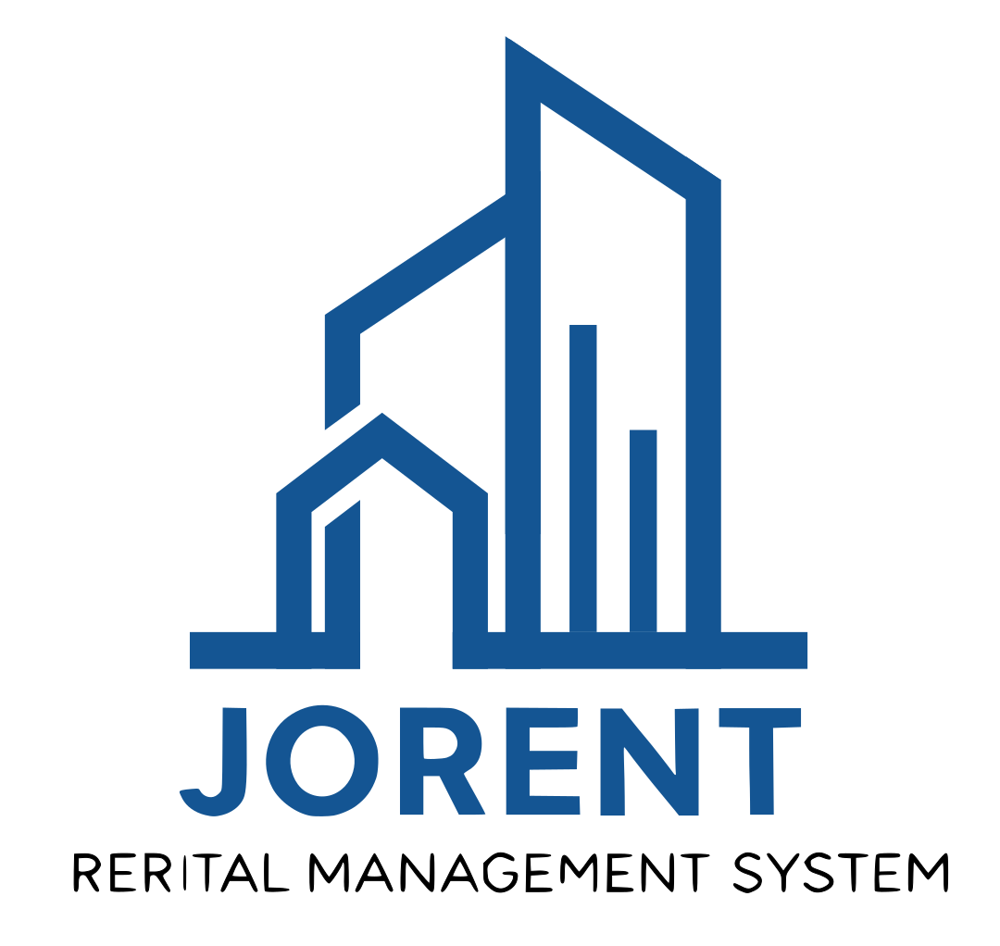

# 🏠 Jorent - Property Rental Management System

<div align="center">
  
  
  [](https://laravel.com)
  [](https://filamentphp.com)
  [](https://php.net)
  [](https://mysql.com)
  [](LICENSE)
</div>

---

## 📋 Overview

**Jorent** is a comprehensive property rental management system designed specifically for the Jordanian market. Built with modern web technologies, it provides landlords, property managers, and tenants with a seamless platform to manage rental properties, contracts, payments, and more.

The system supports both Arabic and English languages with RTL (Right-to-Left) text support, making it accessible to Arabic-speaking users while maintaining international standards.

---

## ✨ Key Features

### 🔐 Multi-User System
- **Admin**: Full system control and management
- **Account Manager**: Property and tenant management
- **Tenant**: Personal dashboard and payment tracking

### 🏢 Property Management
- Property and unit listing with advanced filtering
- Image galleries and detailed property descriptions
- Unit availability tracking and status management
- Location-based search and mapping integration

### 📄 Contract Management
- Digital contract creation and management
- Automated PDF generation with Arabic support
- Digital signature integration
- Contract renewal and termination tracking

### 💰 Payment Management
- Payment tracking with multiple status options
- Automated payment reminders
- Receipt generation and management
- Payment history and analytics

### 🌐 Localization
- Full Arabic and English language support
- RTL (Right-to-Left) layout support
- Culturally appropriate date and currency formatting

### 📊 Dashboard & Analytics
- Responsive admin dashboard powered by Filament v3
- Real-time analytics and reporting
- Customizable widgets and charts
- Export capabilities (PDF, Excel)

---

## 🛠️ Tech Stack

| Technology | Purpose | Version |
|------------|---------|---------|
|  | Backend Framework | 12.x |
|  | Admin Panel | v3.x |
|  | Server Language | 8.2+ |
|  | Database | 8.0+ |
|  | Styling | 3.x |
|  | Frontend Interactivity | 3.x |
|  | Dynamic Components | 3.x |

### Additional Libraries
- **PDF Generation**: mPDF/GPDF for Arabic-compatible PDFs
- **Image Processing**: Intervention Image
- **Email**: Laravel Mail with Gmail SMTP
- **Authentication**: Laravel Sanctum
- **File Storage**: Laravel Storage with multiple disk support

---

## 📸 Screenshots

> 📝 **Note**: Add your actual screenshots here

```markdown
<!-- Replace with actual screenshots -->

*Main Dashboard Overview*

 
*Property Management Interface*


*Contract Creation Workflow*
```

---

## 🚀 Installation Guide

### Prerequisites
- PHP 8.2 or higher
- Composer
- Node.js & NPM
- MySQL 8.0+
- Git

### Step-by-Step Installation

1. **Clone the Repository**
   ```bash
   git clone https://github.com/yourusername/jorent.git
   cd jorent
   ```

2. **Install PHP Dependencies**
   ```bash
   composer install
   ```

3. **Install Node Dependencies**
   ```bash
   npm install
   ```

4. **Environment Configuration**
   ```bash
   cp .env.example .env
   php artisan key:generate
   ```

5. **Configure Database**
   Edit your `.env` file:
   ```env
   DB_CONNECTION=mysql
   DB_HOST=127.0.0.1
   DB_PORT=3306
   DB_DATABASE=jorent_db
   DB_USERNAME=your_username
   DB_PASSWORD=your_password
   ```

6. **Configure Mail Settings** (Optional)
   ```env
   MAIL_MAILER=smtp
   MAIL_HOST=smtp.gmail.com
   MAIL_PORT=587
   MAIL_USERNAME=your_email@gmail.com
   MAIL_PASSWORD=your_app_password
   MAIL_ENCRYPTION=tls
   ```

7. **Run Database Migrations**
   ```bash
   php artisan migrate
   ```

8. **Seed the Database** (Optional)
   ```bash
   php artisan db:seed
   ```

9. **Create Storage Link**
   ```bash
   php artisan storage:link
   ```

10. **Build Assets**
    ```bash
    npm run build
    # or for development
    npm run dev
    ```

11. **Create Admin User**
    ```bash
    php artisan make:filament-user
    ```

12. **Start the Development Server**
    ```bash
    php artisan serve
    ```

Visit `http://localhost:8000` to access the application.

---

## 📖 Usage Instructions

### For Administrators
1. **Login**: Access the admin panel at `/admin`
2. **Property Management**: Add and manage properties through the Properties section
3. **User Management**: Create and manage account managers and tenants
4. **Contract Creation**: Generate contracts with automated PDF export
5. **Payment Tracking**: Monitor all payments and generate reports

### For Account Managers
1. **Dashboard Access**: Login through the designated account manager portal
2. **Property Listing**: List and manage assigned properties
3. **Tenant Relations**: Handle tenant inquiries and applications
4. **Contract Processing**: Process and manage rental contracts

### For Tenants
1. **Portal Access**: Access personal dashboard through tenant portal
2. **Payment History**: View payment history and upcoming dues
3. **Contract Viewing**: Access and download rental contracts
4. **Maintenance Requests**: Submit and track maintenance requests

### Arabic Language Support
- Switch language using the language selector in the top navigation
- All forms and interfaces support RTL text input
- PDF contracts are generated with proper Arabic formatting

---

## 📁 Folder Structure Overview

```
jorent/
├── app/
│   ├── Filament/           # Filament admin panel resources
│   ├── Http/               # Controllers and middleware
│   ├── Models/             # Eloquent models
│   ├── Policies/           # Authorization policies
│   ├── Services/           # Business logic services
│   └── Traits/             # Reusable traits
├── config/                 # Configuration files
├── database/
│   ├── migrations/         # Database migrations
│   ├── seeders/           # Database seeders
│   └── factories/         # Model factories
├── lang/
│   ├── ar/                # Arabic translations
│   └── en/                # English translations
├── public/
│   ├── images/            # Public images
│   ├── uploads/           # User uploads
│   └── pdfs/              # Generated PDFs
├── resources/
│   ├── views/             # Blade templates
│   ├── css/               # Stylesheets
│   └── js/                # JavaScript files
├── routes/                # Route definitions
└── storage/               # File storage
```

---

## 🔗 Model Relations

### Core Models Structure

```php
// Property Model
Property::class
├── hasMany(Unit::class)
├── belongsTo(Landlord::class)
└── hasMany(PropertyImage::class)

// Unit Model  
Unit::class
├── belongsTo(Property::class)
├── hasMany(Contract::class)
└── hasMany(Payment::class)

// Contract Model
Contract::class
├── belongsTo(Unit::class)
├── belongsTo(Tenant::class)
└── hasMany(Payment::class)

// User Models (Separate Tables)
Admin::class
AccountManager::class  
Tenant::class
Landlord::class
```

### Key Relationships
- **Properties** can have multiple **Units**
- **Units** can have multiple **Contracts** (historical)
- **Contracts** generate multiple **Payments**
- **Tenants** can have multiple **Contracts**

---

## 🤝 Contributing

We welcome contributions to improve Jorent! Here's how you can help:

### Development Workflow
1. **Fork the Repository**
2. **Create Feature Branch**
   ```bash
   git checkout -b feature/your-feature-name
   ```
3. **Make Changes**
4. **Run Tests**
   ```bash
   php artisan test
   ```
5. **Commit Changes**
   ```bash
   git commit -m "Add: your feature description"
   ```
6. **Push to Branch**
   ```bash
   git push origin feature/your-feature-name
   ```
7. **Create Pull Request**

### Coding Standards
- Follow PSR-12 coding standards
- Use meaningful commit messages
- Add tests for new features
- Update documentation when needed
- Ensure Arabic/RTL compatibility

### Bug Reports
When reporting bugs, please include:
- Laravel and PHP versions
- Steps to reproduce
- Expected vs actual behavior
- Screenshots (if applicable)

---

## 📄 License

This project is licensed under the MIT License - see the [LICENSE](LICENSE) file for details.

```
MIT License

Copyright (c) 2025 Jorent Team

Permission is hereby granted, free of charge, to any person obtaining a copy
of this software and associated documentation files (the "Software"), to deal
in the Software without restriction, including without limitation the rights
to use, copy, modify, merge, publish, distribute, sublicense, and/or sell
copies of the Software, and to permit persons to whom the Software is
furnished to do so, subject to the following conditions:

The above copyright notice and this permission notice shall be included in all
copies or substantial portions of the Software.
```

---

## 👥 Team & Contact

### Development Team
- **Project Lead**: [Your Name](mailto:your.email@example.com)
- **Backend Developer**: [Developer Name](mailto:dev@example.com)  
- **Frontend Developer**: [Frontend Dev](mailto:frontend@example.com)
- **UI/UX Designer**: [Designer Name](mailto:design@example.com)

### Support & Communication

📧 **Email**: support@jorent.jo  
🌐 **Website**: [www.jorent.jo](https://jorent.jo)  
📱 **WhatsApp**: +962-XX-XXX-XXXX  
🐛 **Issues**: [GitHub Issues](https://github.com/yourusername/jorent/issues)

### For Arabic Speakers / للمتحدثين بالعربية

إذا كنت تحتاج إلى مساعدة باللغة العربية، يرجى التواصل معنا عبر:
- البريد الإلكتروني: arabic-support@jorent.jo
- واتساب: +962-XX-XXX-XXXX

---

<div align="center">

**⭐ If you find this project helpful, please give it a star! ⭐**

Made with ❤️ for the Jordanian real estate market

</div>
